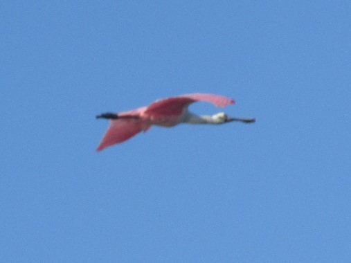
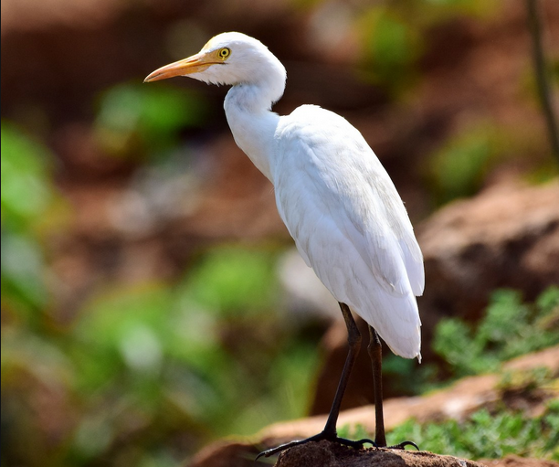
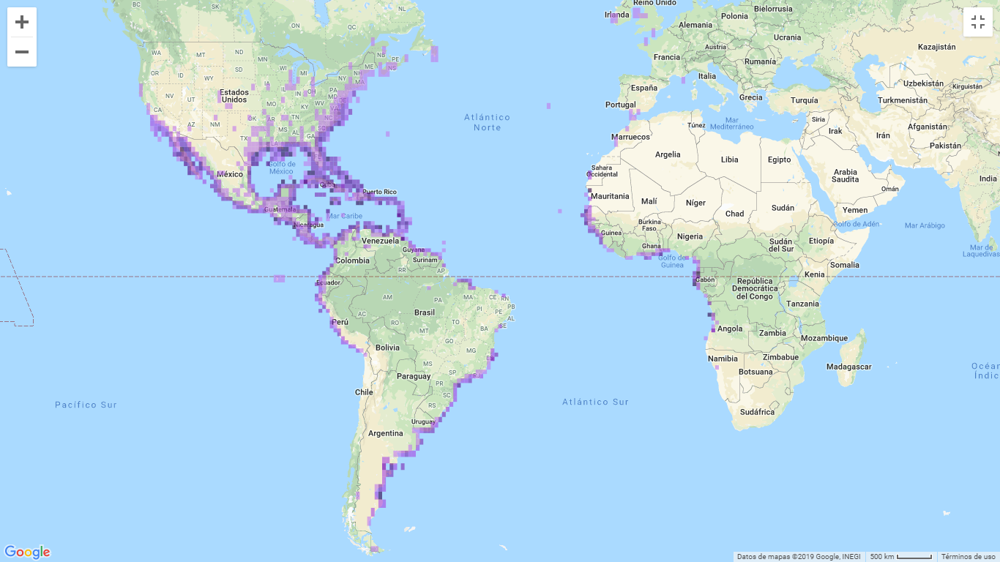
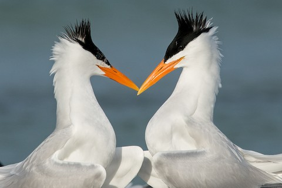

 
Descripción de especies

 
Se presentan especies observadas en Cocorocas, Mataredonda y Chomes respectivamente.

 
***Platalea ajaja***

**Descripción**:Pertenece de la familia Threskiornithidae (Orden Pelecaniformes). Es una especie que mide 81 cm, pesa 1.4 kg; es la única ave grande y rosada en nuestra área; son las principales características para identificarla. En los adultos se logra apreciar la cabeza sin plumaje de colores verduzcos, cuello y cuerpo entre blanco y rosado claro, alas rosadas,  pico verduzco y  patas rojizas (Elizondo, 2013). En la época reproductiva las coloraciones de la cara se torna anaranjado y la bolsa gular tonos verde-azulado. En los juveniles presentan colores blanco, rosas claros y la cabeza está cubierta de plumón (tipo de pluma que se presenta en los pichones de las aves) blanco. Las alas son rosados claros, patas y dedos con tonalidades negras. Se tarda alrededor de  tres años para alcanzar el plumaje de adulto (Elizondo, 2013).

**Distribución**: Se distribuye desde el Sur de Estados Unidos hasta el centro de Chile y Argentina. En la época cálida del año se puede dar avistamientos al Norte de Estados Unidos, al Sur de Chile y Argentina. Además en Malvinas, áreas costeras de las Bahamas e islas del Caribe. En Costa Rica es una especie residente; común en ciertas localidades de la cuenca del río Tempisque, el área de Río Frío y los alrededores del Golfo de Nicoya. Se pueden ver en menor cantidad a lo largo de la costa del Pacífico. Puede existir avistamientos irregulares en la Zona del Caribe y en el Valle Central (Elizondo, 2013). 

**Hábitat,alimentación y comportamiento**: Las especies de espátula presentan diferentes coloraciones en su plumaje y diseño en su pico, siendo recto y aplastado, parecido a una espátula. Este pico es una parte especializada por su forma de alimentación, la cual realiza por medio de la filtración de limos (Guerrero-Cárdenas et al., 2013). Para buscar su alimento, camina en aguas lodosas, de poca profundidad mientras mueve el pico en forma de espátula  de un lado a otro, y un poco abierto para encontrar las presas a través del tacto. En ocasiones atrapa peces pequeños e invertebrados acuáticos. La dieta se compone principalmente de peces pequeños, camarones, cangrejos de agua dulce, cangrejos de mar, insectos acuáticos (como escarabajos), moluscos y babosas. Completa su dieta con material vegetal, tales como raíces y tallos de juncos. (NatureServe, 2007) . El hábitat de la espátula rosada son principalmente  humedales e islas, pero también se logra encontrar en sitios abiertos de poca profundidad, con corrientes de aguas lentas, lo utilizan para anidar, criar o cambiar su plumaje. La mayor anidación de la especie se localiza en Isla Pájaros, cuenca del río Tempisque- Guanacaste (Guerrero-Cárdenas et al.,2013). 

{width=400px}

Figura 1. *Platalea ajaja* observado en la zona de Cocorocas 
Fuente: Ericka Arley

{width=400px}

Figura 2. *Platalea ajaja* en vuelo, observado en Cocorocas
Fuente: Ericka Arley

 
 ***Bubulcus ibis***

**Descripción**: Es de la familia Ardeide (Orden Pelecaniformes). Mide  51  cm,pesa  350  grs. Los  adultos  son  blancos  con  iris,  pico  y  piel  de  la  cara  de  color  amarillo.  Las  patas  son negruzcas   y   la   coronilla,   espalda   y  pecho  teñidos  de ante (Luconi (2014),Stiles & Skutch, (2007)) En  plumaje reproductivo, las aves tienen un color ananjado hasta la corona, también el pecho y la espalda tambien con parches de plumas color beige (Stiles & Skutch, (2007), Kaufman, (2005) . Las patas varían de amarillo/rosa en la temporada reproductiva a grises/negras durante el invierno (Kaufman, 2005 )

**Distribución**: Esta de distribuye de los 1500m a los 7200m , es una especie que está distribuida mundialmente desde los trópicos hasta las zonas templadas (BirdLife International, 2016) .Es residente a lo largo de todo latinoamérica, es  residente y reproductor en todo USA, y en Honduras,Nicaragua, Panamá y Costa Rica (BirdLife International, 2016)

**Hábitat,alimentación y comportamiento**:Se  encuentran  en    sabanas,    pastizales,    manglares,  pantanos  y  áreas  agrícolas. Se  asocian con  el  Ganado, ahí asecha bichos como saltamomentes y otros insectos. Suelen forrajear en males de granja que pueden espantar insectos del pesto y suelen escoger árboles cerca del agua para anidar (Luconi, 2014). 

Estas tienen una asociación con el ganado ya que se asume que en los cuerpos del ganado hay invertebrados como moscas que forman gran parte de la dieta de la garza, y tal vez quita ectoparásitos del cuerpo del animal, además se ha observado que en su mayoría se alimentan de las patas delanteras (Heatwole, 1965)

El método general para cazar de *B.ibis* es caminar despacio dispersado con corridas hábiles dirigido hacia la presa ya observada, cuando el animal es localizado, es caputado por una corrida corta seguido a una puñalada. Las pequeñas son tragadas inmediatamente mientras que las más grandes como ranas o lagartijas son picoteadas a muerte. Oro de los comportamientos de caza es cuando observa a la presa, el ave extiende la cabeza y el cuello hacía adelante hasta que el cuerpo está casi horizontal, luego comienza a balancear la cabeza y el cuello de atrás para delante, hasta que el primer picoteo se consigue (Blaker, 1969).

Esta hace nidos en épocas diferentes a las demás especies de garzas, y en vegetación alta, pueden usar ramas de angle para construir sus nidos,aportando material nuevo durante  la incubación y cuando los pichones ya hayan nacido, además se estima que dura entre 3 y 11 días (Denis *et al*.,2003). 

{width=400px}

Figura 3. Adulto reproductivo de *Bubulcus ibis* fotografía tomada de Ebird

{width=400px}

Figura 4. Adulto  de *Bubulcus ibis* fotografía tomada de Ebird

***Thalasseus maximus***

**Descripción**:Es un ave que se encuentra en la familia  Laridae (Orden 	Charadriiformes). Un individuo en estadío adulto llega a medir 48 cm y pesar 450g, siendo esta un ave grande. El pico es delgado y de un color anaranjado (fácil de ver en campo), y las patas son negras. Otra de las características a resaltar es que la parte posterior de la coronilla y la cresta nucal son  negras. Parte inferior del cuerpo (cabeza, cuello, abdomen, cola) es de color blanco y las alas son de un gris claro. Las primarias son más oscuras, y la cola es profundamente ahorquillada  (Stiles & Skutch, 2007).

{width=400px}

Figura 5.  Características corporales de un adulto de *Thalasseus maximus* en estado reproductivo.

{width=400px}

Figura 6.  *Thalasseus maximus* en vuelo, observar las características de las primarias y la cola.

**Distribución**: Esta es una especie migratoria que posee una amplia distribución, la reproducción la realiza desde el Suroeste y Este de Estados Unidos hasta el Norte de México, las Antillas, el Este de Suramérica hasta Uruguay. Por otra parte, invierna tanto en la costa pacífica como atlántica desde el Sur de Estados Unidos hasta Argentina; al Oeste de África y S de Europa (Stiles & Skutch, 2007). Pasada la época reproductiva, los individuos se dispersan a lo largo de las costas  tropicales y subtropicales (Buckley & Buckley, 2002).

{width=400px}

Figura 7.Mapa de distribución de *Thalasseus maximus*

**Hábitat,alimentación y comportamiento**: Su comportamiento a la hora de alimentarse, se caracteriza por, pescar en pequeños grupos o de forma solitaria en las costas, bahías de sal, estuarios; sobretodo en aguas poco profundas. También posee la habilidad de zambullirse desde el vuelo para atrapar peces pequeños, en ocasiones mientras va volando roza el agua con el pico. Además, de robar la comida de otras aves (Stiles & Skutch, 2007; Audubon Online). 

Esta especie realiza bailes de cortejo en donde dos o más individuos vuelan en espiral o sino el macho en tierra firme le ofrece comida a la hembra, estos se inclinan y se contornean en círculos. El nido es construido en el suelo por ambos padres, y estos alimentan a sus crías, las cuales, son reconocidas por los sonido que realizan. Estas pertenecen hasta 8 meses con sus padres para finalmente migrar con ellos. El cuidado parental se da en colonias de crías y la primera reproducción se presenta de forma tardía. Son una especie altamente social (Neotropical Birds Online; Audubon Online)

{width=400px}

Figura 8.Cortejo de *Thalasseus maximus*.

**Referencias** 

BirdLife International 2016. Bubulcus ibis. The IUCN Red List of Threatened Species

Blaker, D. (1969). Behavious of the cattle egret *Ardeola ibis*.Ostrich, 40(3), 75–129. doi:10.1080/00306525.1969.9634335

Buckley, P. A. and F. G. Buckley (2002). Royal Tern (*Thalasseus maximus*), version 2.0. In The Birds of North America (A. F. Poole and F. B. Gill, Editors). Cornell Lab of Ornithology, Ithaca, NY, USA. https://doi.org/10.2173/bna.700

Denis,D,Rodríguez,A,Rodríguez,P,Jimenez,A. (2003). Reproducción de la garza ganadera (*Bubulcus ibis*)en la ciénaga de Biramas,Cuba. The Journal of Caribbean Ornithology. 16. 45-54. 

Elizondo, L. (2013).*Platalea ajaja*. Biodiversidad de Costa Rica (InBio). Recuperado de: http://www.crbio.cr:8080/neoportal-web/species/Platalea%20ajaja  

Garrigues, Richard., P. Camacho-Varela, M. Montoya, P. O’Donnell, O. Ramírez-Alán, J. Zook. 2018. Lista Oficial de las Aves de Costa Rica – Actualización 2018. Comité de Especies Raras y Registros Ornitológicos de Costa Rica (Comité Científico), Asociación Ornitológica de Costa Rica. Zeledonia 22:2. San José, Costa Rica. (Versión Online. Incluye últimos cambios aceptados por el Comité publicados primero en-línea).

Guerrero-Cárdenas, I, Tovar-Zamora,Roberto, I, Cruz, O, Escobar-Flores,J Guerrero-Tovar, I. (2013). Veinte años de ausencia: avistamientos recientes de la espátula rosada (*Platalea ajaja*) en la Bahia de la Paz, Baja California Sur, Mexico. HUITZIL.14(2): 105-109.

Heatwole, H. (1965). Some aspects of the association of cattle egrets with cattle. Animal Behaviour, 13(1), 79–83. doi:10.1016/0003-3472(65)90075-8 

Kaufman, K. (2005). Guía de campo a las aves de Norteamérica. Houghton Mifflin Harcourt.

NatureServe. 2007. NatureServe Explorer: An online encyclopedia of life [web application]. Version 6.2. NatureServe, Arlington, Virginia.

Luconi,S. (2014). Guía de Campo/ Fauna dentro de Portasol, Portasol rainforest & Ocean Living.

Royal Tern (*Thalasseus maximus*), En Neotropical Birds Online (TS Schulenberg, Editor). Laboratorio de Ornitología de Cornell, Ithaca, NY, EE. UU. Recuperado de Neotropical Birds Online: https://neotropical.birds.cornell.edu/Species-Account/nb/species/royter1

Royal Tern (*Thalasseus maximus*), En Audubon Online (Texto © Kenn Kaufman, adaptado de Lives of North American Birds). Recuperado de Audubon Online: https://www.audubon.org/field-guide/bird/royal-tern

Stiles, F. G., & Skutch, A. F. (2007). Guía de aves de Costa Rica. Editorial INBio.

